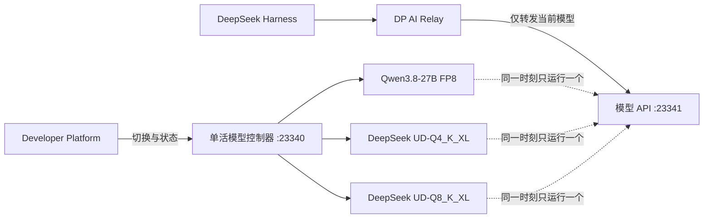

# DSH-013：DeepSeek-V4-Flash-0731 双量化部署与三模型切换报告

- 日期：2026-08-20
- 目标主机：`gys@202.117.3.254`，8 × RTX 4090 24GB
- 最终默认模型：`DeepSeek-V4-Flash-0731-Q8_K_XL`
- 上下文：262,144 tokens

## 1. 结论

本次部署已在不修改 Qwen Python 环境和推理参数的前提下，完成 DeepSeek-V4-Flash-0731 `UD-Q4_K_XL` 与 `UD-Q8_K_XL` 两套 GGUF 权重、隔离运行环境、llama.cpp CUDA 推理服务、DSpark 投机解码、256K 上下文、DP AI Relay 三模型单活切换以及 DSH 选择能力。最终选择 Q8 作为默认模型：它在 ModelScope 模型卡中被标为 lossless，实测单路解码比 Q4 慢约 4%–5%，但质量保真优先，且 256K 上下文仍可稳定装入 8 × 4090。

本机 DeepSeek-V4-Flash-0731 的稳定单路速度约为 43–55 tok/s，取决于任务和 DSpark 接受率。Q4 的 DSpark 相对无投机解码基线提升 29.97%；没有发现能在保持同一模型、同一精度、256K 上下文和当前 llama.cpp 实现的同时稳定达到 125–150 tok/s 的配置。125 tok/s 以上是此前 Qwen3.8-27B FP8 + SGLang MTP4 的模型与执行栈结果，不能直接外推到本次大体量 GGUF 模型。

## 2. 交付范围

- ModelScope 权重目录：
  - `/data1/gys/models/DeepSeek-V4-Flash-0731-UD-Q4_K_XL`
  - `/data1/gys/models/DeepSeek-V4-Flash-0731-UD-Q8_K_XL`
- 独立运行根目录：`/data1/gys/deepseek-v4`
- 独立 Python 环境：`/data1/gys/deepseek-v4/env`
- 固定 llama.cpp 提交：`fe8156f789011f6ea0baf6917ea09f88b89d9554`
- CUDA 构建：`/data1/gys/deepseek-v4/src/llama.cpp/build-cuda121-sm89-isolated`
- 模型服务：`127.0.0.1:23341`
- 单活控制器：`127.0.0.1:23340`
- 反向隧道：仅映射到 Relay 主机 Compose 私有地址 `172.18.0.1`，不绑定公网网卡
- DP 可切换模型：Qwen3.8-27B-FP8、DeepSeek Q4、DeepSeek Q8
- DSH 可选择上述三个逻辑模型，但不会自动装卸模型



DP 是模型运行状态的唯一事实源。切换期间 Relay 返回 HTTP 503；请求未激活的逻辑模型返回 HTTP 409。控制器会串行化切换、检查 `/health` 与精确模型别名，并在 2,700 秒内未健康时回滚到上一个模型。45 分钟阈值用于覆盖当前机械盘上的 Q8 + DSpark 完全冷加载。若控制器在切换中重启，会从持久化目标续接健康等待而不重复运行启动脚本。系统没有使用多模型路由，也不会同时常驻三份权重。

## 3. 固定配置

DeepSeek 两个量化版本使用相同生产配置，以保证 A/B 对比有效：

| 项目 | 配置 |
| --- | --- |
| 上下文 | 262,144 |
| 并行槽位 | 1 |
| GPU | 0–7，8 路 layer split |
| KV cache | K/V 均为 Q8_0 |
| Flash Attention | 开启 |
| DSpark | 开启，`n_max=3` |
| DSpark KV | Q4_0 |
| batch / ubatch | 2048 / 512 |
| CUDA graphs | 关闭 |
| Prefix cache | 开启，RAM cache 64GB，idle slot cache 开启 |
| Reasoning | DeepSeek 格式，预算由 API 请求控制 |

CUDA graphs 关闭不是保守猜测：固定构建在异构请求复用图时复现过致命 cuBLAS shape error。256K + Q8 的最低显存余量只有 709 MiB，因此生产环境必须保留单槽位、Q8 KV 和关闭 graphs 的组合，不应直接提高 `PARALLEL`。

## 4. 性能结果

所有速度均来自服务端 timings；并发测试同时记录客户端聚合吞吐，避免将排队时间误当成单请求 decode 性能。

| 测试 | UD-Q4_K_XL | UD-Q8_K_XL |
| --- | ---: | ---: |
| 混合复杂任务 4 × 512，均值 / 中位数 | 50.71 / 47.41 tok/s | 48.41 / 46.66 tok/s |
| 混合任务单次范围 | 46.72–61.30 tok/s | 44.83–55.49 tok/s |
| 工具调用 decode | 55.74 tok/s | 52.92 tok/s |
| 4 请求客户端聚合吞吐 | 27.72 tok/s | 51.09 tok/s |
| 255,990-token prompt prefill | 541.58 tok/s | 533.78 tok/s |
| 256K 测试 decode | 45.42 tok/s | 43.51 tok/s |
| 256K 最低显存余量 | 1,361 MiB | 709 MiB |
| 相同长前缀第二次缓存命中 | 99.998% | 99.998% |

Q4 无 DSpark 的混合任务均值为 39.02 tok/s；启用 `n_max=3` 后为 50.71 tok/s，提升 29.97%。继续提高草稿长度并不等价于继续加速：接受率下降、校验开销和 DSpark 自身显存会抵消收益，长上下文还会放大草稿 KV 占用。`n_max=3` 是本机实测后选定的稳定点。

Q8 的四个 512-token 混合任务分别为 46.54、46.77、44.83、55.49 tok/s。真实 DSH Q8 + Xhigh 只读工具任务完成三次正确文件读取并输出严格 JSON，总用时 57 秒，首 token 14 秒，界面报告 52 tok/s、缓存命中 41%、输入 25.2K、输出 1.9K。

最终 Qwen → Q8 冷切换完成后，又在 DSH 新会话中验证默认模型仍为 Q8 + Xhigh，并得到精确响应 `FINAL_Q8_OK`。该短请求总用时约 21 秒、首 token 约 22 秒，界面显示 88 tok/s；由于只有 7 个输出 token，这个 88 tok/s 仅作为端到端可用性证据，不纳入吞吐均值。

## 5. 256K 上下文与显存

Q4 和 Q8 均完成 255,990-token 输入加 215-token 输出，不是只完成模型加载。Q4 总墙钟约 478 秒，Q8 约 485 秒；两者均未发生 CUDA OOM。Q8 在最紧张 GPU 上仅余 709 MiB，因此这是“可用但余量有限”的生产配置。

Prefix cache 实际工作正常。相同长前缀复用时两种量化均报告 99.998% 命中；Q8 重复请求墙钟约 3.71 秒，Q4 约 5.49 秒。DSH 面板早期显示 0% 的根因是上游 usage 统计字段未上报，并非缓存未启用。

## 6. 能力与质量检查

工具测试要求模型一次生成两个并行函数调用，Q4 与 Q8 均正确给出函数名与参数。Q4 DSpark 接受率为 83.33%，Q8 为 81.08%。结构化 JSON、中文架构设计、代码任务、事故推理计划和长上下文检索均成功完成。

Q8 的质量判断基于两层证据：其一，ModelScope 的 Unsloth 模型卡将 UD-Q8_K_XL 标为 lossless；其二，同一套本机能力测试中没有观察到相对 Q4 的工具、结构化输出或意图理解退化。这里的“未观察到退化”不等于覆盖所有业务领域；高风险上线仍应使用真实业务回归集持续抽检。Xhigh 推理在较小输出预算下可能把 token 全部消耗在思考中，调用方应给足输出预算或按任务降低 reasoning effort。

## 7. 并发与 Relay 限流

模型服务器维持一个 llama.cpp slot，以保护 256K 上下文显存。Relay 全局准入上限为 16，上游并发为 4；超过单槽位时请求会排队，因此“允许 16 个请求”代表可靠准入和排队，不代表 16 路同时解码。

API Key 并发已经实现创建时配置和后续编辑。实测临时 Key：限制为 1 时，两次并发请求一个成功、一个在 0.342 秒返回 HTTP 429 `key_concurrency_exceeded`；修改为 2 后两次同时成功；修改为 8 时 Key 与租户上限同步扩到 8。测试 Key 最后已禁用，使用审计保留。

## 8. 切换与回滚验证

三条路径都经过真实切换，不是只验证脚本语法：

| 路径 | 结果 | 冷启动时间 |
| --- | --- | ---: |
| Q8 → Q4 | 成功；Relay 只接受 Q4，Q8 返回 409 | 23 分 28 秒 |
| Q4 → Qwen | 成功；文本与视觉输入均通过公网 Relay | 55 秒 |
| Qwen → Q8 | 成功；最终保持 Q8，控制器中断恢复未重启模型 | 27 分 05 秒 |

Q4 冷加载约 126.7GB；Q8 主权重约 161.9GB，另有约 10.9GB DSpark。`/data1` 当前为机械盘，因此切换分钟级时间主要由磁盘读取决定。最终 Qwen → Q8 从 2026-08-20 02:46:38 到 03:13:43，共 27 分 05 秒。切换中公网推理会明确返回 503 `model_switch_in_progress`，不会把请求误送给旧模型。Qwen 回滚仍调用原生产脚本，视觉上限保持每请求 9 张图片 + 3 段视频。

## 9. 驱动重启兼容

检查发现当前已加载 NVIDIA 内核模块为 570.144，但系统 `libcuda.so.1` 与 `libnvidia-ml.so.1` 已指向 580.173.02；这是当前直接运行系统 `nvidia-smi` 报 driver/library mismatch 的原因。服务此前能运行，是因为启动脚本固定加入私有 570 兼容库。

固定 570 路径在主机未来重启并加载 580 内核后会变成反向不匹配。因此新增 `select-nvidia-driver-libs.sh`：读取 `/proc/driver/nvidia/version`，存在对应私有兼容目录时使用它，否则验证并使用系统库。DeepSeek 与 Qwen 回滚启动链路都改为调用这一选择器；Qwen 修改前文件保留 `.pre-dsh013-driver-auto` 备份，模型环境和推理参数未修改。当前 570 路径已通过 `status-server.sh` 与 8 卡查询验证；重启后仍需按运维清单做一次 580 实机启动复核。

## 10. 运维命令

```bash
# 查看单活状态
source /data1/gys/deepseek-v4/control/model-controller.env
curl -H "Authorization: Bearer $MODEL_CONTROL_TOKEN" \
  http://127.0.0.1:23340/v1/status

# 本机查看服务和显存
/data1/gys/deepseek-v4/scripts/status-server.sh

# 一键切换（通常由 DP 调用控制器，不建议绕过 DP）
/data1/gys/deepseek-v4/scripts/switch-model.sh DeepSeek-V4-Flash-0731-Q8_K_XL

# 回滚 Qwen
/data1/gys/deepseek-v4/scripts/switch-model.sh Qwen3.8-27B-FP8
```

控制 token、Relay API Key 和 DSH credentials 都只保存在对应权限文件中，未写入 Git 或本文。模型端口与控制端口均不暴露公网；公网只开放 DP/Relay 正常入口。

## 11. 复现与证据位置

- 部署脚本：`dev/deepseek-v4-flash-0731/`
- 远端结果：`/data1/gys/deepseek-v4/results/`
- Q8 日志：`/data1/gys/deepseek-v4/logs/server-UD-Q8_K_XL.log`
- Q4 日志：`/data1/gys/deepseek-v4/logs/server-UD-Q4_K_XL.log`
- 控制器状态：`/data1/gys/deepseek-v4/control/model-controller-state.json`
- DSH 本地配置：`C:\Users\chuansgu\.dsh\settings.yaml`

外部实现依据：

- [ModelScope：Unsloth DeepSeek-V4-Flash-0731-GGUF](https://modelscope.cn/models/unsloth/DeepSeek-V4-Flash-0731-GGUF)
- [llama.cpp server 文档](https://github.com/ggml-org/llama.cpp/blob/master/tools/server/README.md)
- [llama.cpp speculative decoding 实现](https://github.com/ggml-org/llama.cpp/blob/master/common/speculative.cpp)
- [llama.cpp DSpark 模型实现](https://github.com/ggml-org/llama.cpp/blob/master/src/models/dflash.cpp)

以上外部资料用于确定格式支持与实现边界；速度、显存、缓存、工具和并发数据均为本机实测结果。
